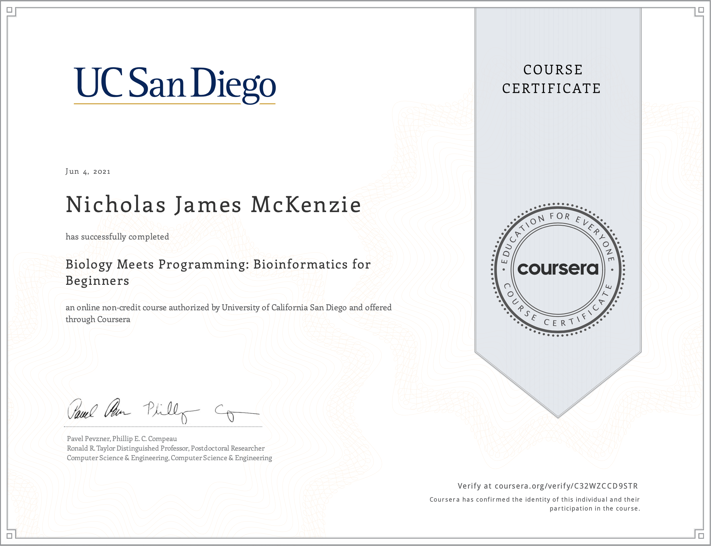

## [Biology Meets Programming: Bioinformatics for Beginners](https://www.coursera.org/learn/bioinformatics?) 

<b>Course description:</b> 
This course will cover algorithms for solving various biological problems along with a handful of programming challenges helping you implement these algorithms in Python.  It offers a gently-paced introduction to our Bioinformatics Specialization (https://www.coursera.org/specializations/bioinformatics), preparing learners to take the first course in the Specialization, "Finding Hidden Messages in DNA" (https://www.coursera.org/learn/dna-analysis).
Each of the four weeks in the course will consist of two required components.  First, an interactive textbook provides Python programming challenges that arise from real biological problems. Second, each week will culminate in a summary quiz.

All algorithms must be optimised to run in under five minutes per problem, which more often than not means that the first and/or most simple algorithm you try won't work efficiently enough to pass the course.

Code is not hosted here to comply with course guidelines. I may post my study notes which helped me get through the course at a later date.

Verify this certificate at: [coursera.org/verify/C32WZCCD9STR](https://www.coursera.org/verify/C32WZCCD9STR)

---

### Week 01: Where in the Genome Does Replication Begin? (Part 1)

* Determine the length of the <i>Vibrio cholera</i> genome.
* Write a function called PatternCount which finds the number of times a DNA motif is
found within a DNA sequence (exact match).
* Write a function called FrequencyMap with which you can specify a motif length k, and the
algorithm will store all possible k-mers that appear in a DNA sequence in a Python dictionary
as keys and the number of times each k-mer appears as its corresponding value.
* Write a function called FrequentWords which makes use of the FrequencyMap function to
return a list of k-mers of specified length k which occur the most often within a DNA sequence
* Write a function called Reverse which takes a string and reverses them.
* Write a function called Complement which takes a string of DNA nucleotides and
returns the complementary DNA strand.
* Write a function called ReverseComplement which accepts a string of DNA nucleotides and
uses the Reverse and Complement functions to return the reverse complement DNA sequence.
* Write a function called PatternMatching which accepts a DNA genome string and short
DNA pattern string and returns the indices at which the pattern occurs as an exact match
in the genome.
* Pass a quiz making use of the above algorithms on provided datasets.

---

### Week 02: Where in the Genome Does Replication Begin? (Part 2)

* Write a function called SymbolArray which returns a symbol array from a DNA genome string and single
nucleotide of choice (A, T, G, or C).
* Write a function called FasterSymbolArray, with an improved algorithm of SymbolArray.
* Write a function called SkewArray, an array used to keep track of the difference between the total number of occurrences of G and the total number of occurrences of C at every point in the genome.
* Write a function called MinimumSkew which uses SkewArray to return the index at which the minimum skew value occurs.
* Write a function called HammingDistance, which returns the number of different bases when comparing two DNA sequences.
* Write a function called ApproximatePatternMatching, which uses HammingDistance and accepts a DNA pattern, a long DNA sequence, and an integer d to return indices in the long DNA sequence at which the DNA pattern appears with at most d mismatched bases.
* Write a function called ApproximatePatternCount which is like ApproximatePatternMatching, but returns the number of approximate matches.
* Pass a quiz making use of the above algorithms on provided datasets, as well as
some related biology theory.

---

### Week 03: Which DNA Patterns Play the Role of Molecular Clocks? (Part 1)

* Write a function called Count, which takes a list of strings Motifs as input and returns the count matrix of Motifs (as a dictionary of lists).
* Write a function called Profile which uses Count and takes Motifs as input and returns their profile matrix as a dictionary of lists.
* Write a function called Consensus which uses Count and takes a list of strings Motifs as input and returns the consensus string of Motifs.
* Write a function called Pr which computes a profile matrix for a DNA sequence.
* Write a function called ProfileMostProbablePattern which accepts a string Text, an integer k, and a 4 x k matrix Profile, and returns a Profile-most probable k-mer in Text.
* Write a function called Score which allows us to calculate a score for motifs in GreedyMotifSearch.
* Write a function called GreedyMotifSearch, which uses many of the above functions in a complex algorithm to find the set of motifs across a number of DNA sequences that match each other most closely.
* Pass a quiz making use of the above algorithms on provided datasets, as well as
some related biology theory.

---

### Week 04: Which DNA Patterns Play the Role of Molecular Clocks? (Part 4)

* Write a function CountWithPseudocounts, which takes a list of strings Motifs as input and returns the count matrix of Motifs with pseudocounts as a dictionary of lists.
* Write a function ProfileWithPseudocounts that uses CountWithPseudocounts to that take a list of strings Motifs as input and returns the profile matrix of Motifs with pseudocounts as a dictionary of lists.
* Write a function GreedyMotifSearchWithPseudocounts which takes a list of strings Dna followed by integers k and t and returns the result of running GreedyMotifSearch, where each profile matrix is generated with pseudocounts
* Write a function Motifs that takes a profile matrix Profile corresponding to a list of strings Dna as input and returns a list of the Profile-most probable k-mers in each string from Dna. Then add this function to Motifs.py.
* Write a function RandomMotifs(Dna, k, t) that uses random.randint to choose a random k-mer from each of t different strings Dna, and returns a list of t strings.
* Write a function Normalize(Probabilities) which takes a dictionary Probabilities whose keys are k-mers and whose values are the probabilities of these k-mers (which do not necessarily sum to 1). The function should divide each value in Probabilities by the sum of all values in  Probabilities, then return the resulting dictionary.
* Write a function WeightedDie(Probabilities). This function takes a dictionary Probabilities whose keys are k-mers and whose values are the probabilities of these k-mers. The function should return a randomly chosen k-mer key with respect to the values in Probabilities.
* Write a function ProfileGeneratedString(Text, profile, k) that takes a string Text, a profile matrix profile, and an integer k as input. It should then return a randomly generated k-mer from Text whose probabilities are generated from profile, as described above.
* Write a function GibbsSampler which is a more cautious version of RandomizedMotifSearch, and utilises many of the above functions. It takes a parameter N corresponding to the number of iterations that we plan to run the program. The algorithm discards a single k-mer from the current set of motifs at each iteration and decides to either keep it or replace it with a new one.
